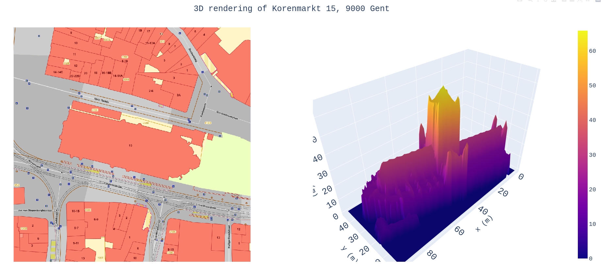

# 3D rendering of properties in Flanders, Belgium
# Description
This program renders a 3D model of a property in Flanders, Belgium, given a
postal address.
# Requirements
This program uses Python 3.9.10. See the file requirements.txt for packages
requirements.

This program assumes that you have stored the data frome the following links

- [DSM](http://www.geopunt.be/download?container=dhm-vlaanderen-ii-dsm-raster-1m&title=Digitaal%20Hoogtemodel%20Vlaanderen%20II,%20DSM,%20raster,%201m)
- [DTM](http://www.geopunt.be/download?container=dhm-vlaanderen-ii-dtm-raster-1m&title=Digitaal%20Hoogtemodel%20Vlaanderen%20II,%20DTM,%20raster,%201m)

in `./../../data_rasters/dsm` and `./../../data_rasters/dtm` respectively.

# Installation

In a terminal, at the root of this project, run
```bash
python src/main.py
```

# Example

